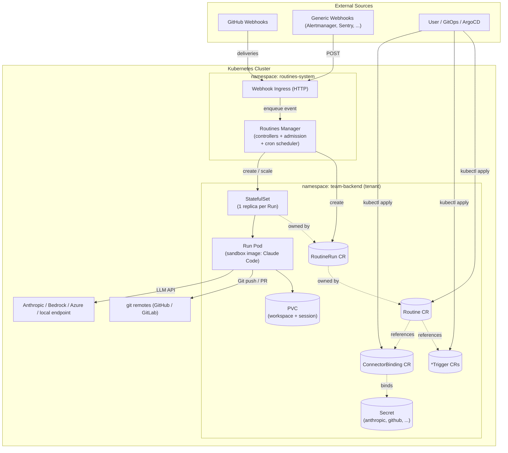
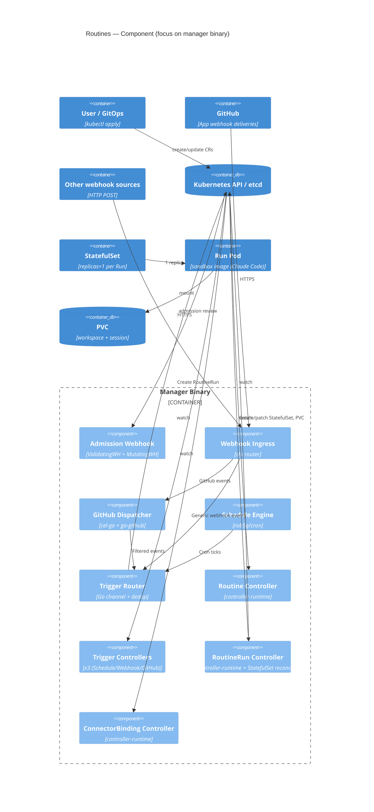
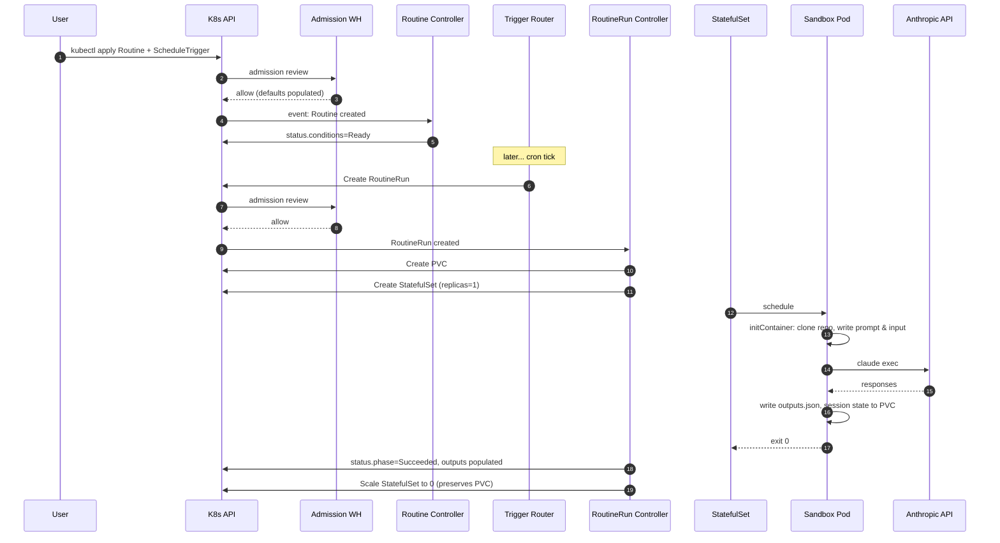
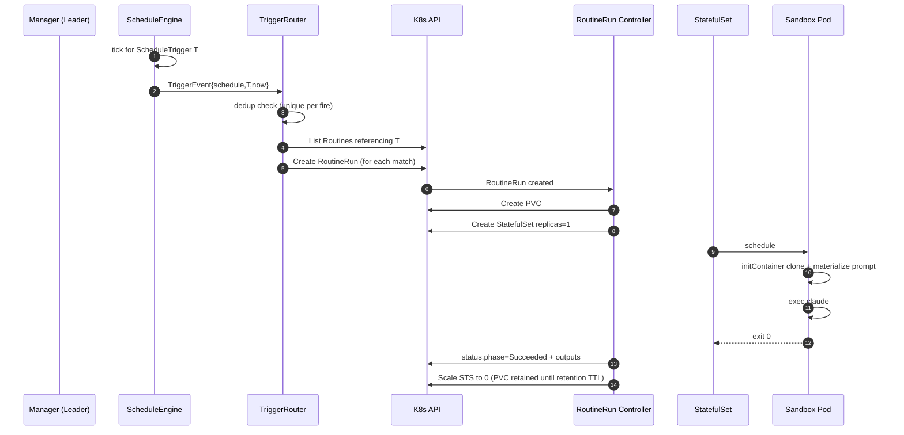
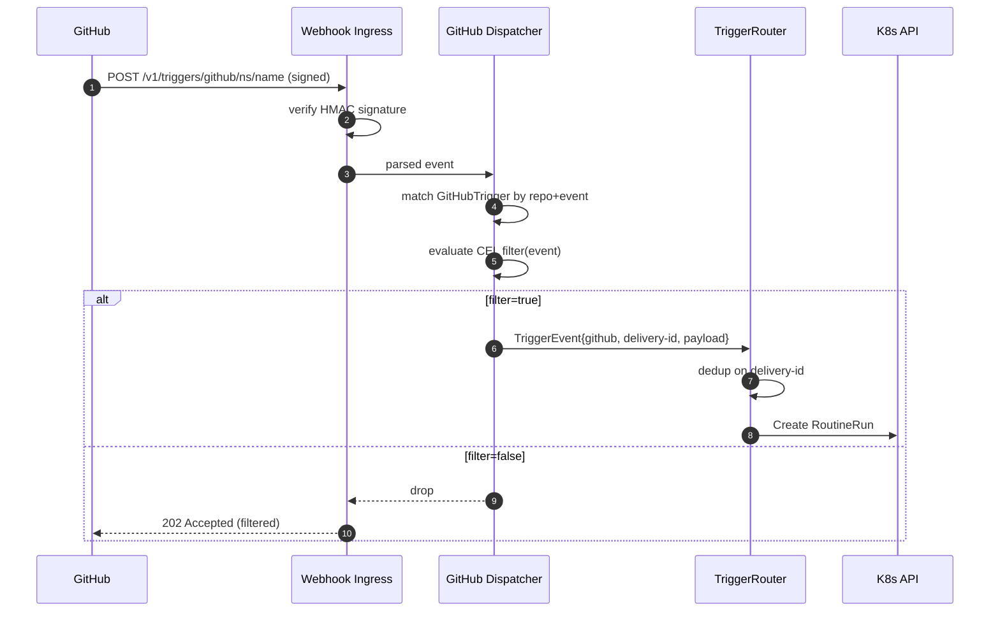
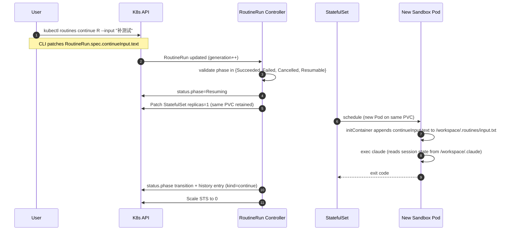
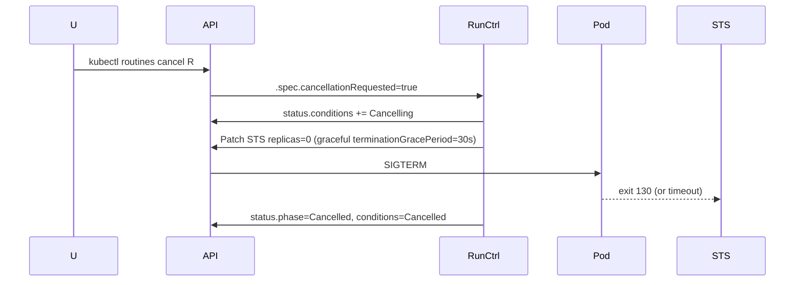
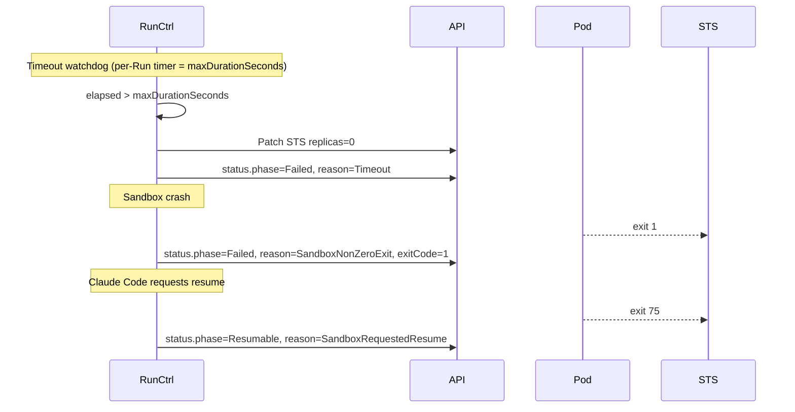

# Routines Architecture Document

**Author:** Winston (Architect) · **Date:** 2026-04-16 · **Mode:** yolo

## Introduction

This document is the authoritative backend architecture for **Routines** — a self-hosted, Kubernetes-native open-source clone of Claude Routines. It translates [`_bmad-output/prd.md`](./prd.md) (PRD rev 3, status `complete`) into a concrete system design that guides AI-driven implementation.

Scope of this document:

- API contracts (CRDs and HTTP webhook ingress)
- Component responsibilities and runtime topology
- Data model, persistence, and Run lifecycle (StatefulSet + PVC)
- Cross-cutting concerns: security, observability, error handling, testing
- Source tree, tooling, and deployment (Helm) conventions

**Out of scope:**

- Frontend / Dashboard architecture. MVP has no UI (PRD Scope Decision Summary: Web Dashboard = ❌ MVP). If a read-only Dashboard is added in Phase 2 (FR36), a separate Frontend Architecture doc will be produced.
- Claude Code internals. Routines treats Claude Code as an opaque binary within the sandbox image and only depends on its exit-code contract + filesystem layout (see `Sandbox Runtime Contract`).

### Starter Template or Existing Project

**Decision:** **kubebuilder v4** (operator-sdk compatible scaffolding) as the starter for the core repository; **no other starter template** for auxiliary components.

Rationale:

- PRD mandates K8s-native CRDs + Operator, Go 1.22+, controller-runtime. kubebuilder is the canonical scaffolding tool for that stack and emits the exact layout the community expects.
- Gives us `config/crd`, `config/rbac`, `config/manager`, `config/webhook`, `Dockerfile`, `Makefile`, and `hack/` for free, all of which align with the Tech Stack choices below.
- Helm chart is built by hand (no starter) because kubebuilder's default Kustomize output is insufficient for the `agentImage` override and `ScheduleTrigger` admission policy knobs we expose.

If the kubebuilder scaffold conflicts with a later decision, the `PROJECT` manifest will be edited rather than discarded.

### Change Log

| Date       | Version | Description                                                     | Author  |
| ---------- | ------- | --------------------------------------------------------------- | ------- |
| 2026-04-16 | 0.1.0   | Initial architecture draft from PRD rev 3 in yolo mode          | Winston |

---

## High Level Architecture

### Technical Summary

Routines is a **Kubernetes Operator in Go (kubebuilder / controller-runtime)** plus a **sidecar HTTP webhook ingress** and a **sandboxed per-Run execution Pod** running Claude Code. The system exposes four CRDs — `Routine`, `ScheduleTrigger` / `WebhookTrigger` / `GitHubTrigger`, `RoutineRun`, `ConnectorBinding` — and reconciles Run execution as a 1-replica `StatefulSet` bound to a dedicated `PersistentVolumeClaim`. Triggers arrive either via the in-cluster scheduler (cron) or via the public HTTP ingress (webhooks / GitHub events); both paths converge on a unified **`RoutineRun` creation pipeline** protected by a delivery-id / idempotency-key dedup store. Primary technology choices: Go 1.22, controller-runtime v0.18+, kubebuilder v4, CEL-go for GitHub event filtering, go-cron for scheduling, standard K8s `client-go`. The architecture is **event-driven + declarative**: triggers → event fan-in → admission-validated `RoutineRun` → StatefulSet reconcile → sandbox Pod → result reconciliation → audit state. This supports PRD goals for U1 (5-minute install), U3 (1:1 migration from upstream), T1 (multi-distro conformance), T2 (idempotent, replayable), T3 (namespace-bounded blast radius), and FR13a (session-resumable Runs via PVC reuse).

### High Level Overview

1. **Architectural style:** Event-driven, reconciliation-based Kubernetes Operator. Not a "backend service" in the HTTP-CRUD sense — the system's source of truth is etcd (CRDs) and the control loop is Kubernetes' reconciler pattern.
2. **Repository structure:** **Monorepo** (decision below). Single Git repo (`github.com/a2d2-dev/routines`) houses operator, webhook ingress, CLI plugin, Helm chart, samples, and docs site source. Per PRD implementation-considerations §"Sample library" + `routines-contrib` split, community Connectors will live in a separate `routines-contrib` repo post-MVP.
3. **Service architecture:** Single **multi-binary** Go module. Two executables share code: `manager` (core operator + webhook ingress + admission + CRD reconcilers) and `kubectl-routines` (CLI plugin). We deliberately do **not** split the operator and webhook ingress into separate binaries for MVP — one binary keeps deploy topology simple and leader election uniform. We will split when `NFR-P3` (webhook 100 req/s, P99 < 200ms) forces horizontal scaling of only the ingress.
4. **Primary data flow:**

   ```
   trigger source ──▶ ingress handler / cron loop ──▶ idempotency check
                     ──▶ Routine resolver (finds matching Routine(s))
                     ──▶ RoutineRun CR created (admission webhook validated)
                     ──▶ RoutineRun controller reconciles
                           └─▶ PVC provision ──▶ StatefulSet scale 0→1 ──▶ Pod Running
                                                   └─▶ repo clone, Secret mount, prompt injection
                                                   └─▶ Claude Code execs
                                                   └─▶ exit code + outputs file
                           └─▶ status.phase update + Events + audit
                           └─▶ StatefulSet scale 1→0 (terminal) OR stays for Resumable
   ```

5. **Key architectural decisions:**
   - **CRD as the API** (not REST). All user interaction is via `kubectl apply`. The only HTTP surface is inbound webhooks and (optionally) the CLI plugin's local calls to the K8s API.
   - **StatefulSet per Run** (not Job / not Pod-owned-by-CRD). Justification in `Run Lifecycle Design`: gives us stable identity, PVC affinity, and — critically — the ability to scale to 0 and back to 1 to implement `continue`/`Resumable`.
   - **PVC per Run, retained by policy.** Gives FR13a (session resume) first-class support; reclaimed via `FR13b` retention policies.
   - **CEL for GitHub filter.** Beats a DSL because it is inspectable, well-known in the K8s community (admission policies use it), and there is a mature Go library (`cel-go`).
   - **No "Environment" CRD.** We reuse Namespace as the environment boundary (PRD Environment Model). This removes a whole swathe of design work.
   - **Claude Code is opaque.** The operator does not parse Claude Code stdout. It contracts on (a) exit code, (b) the PVC's `/workspace/.routines-outputs/*.json` file, and (c) standard env vars. This keeps us pinned-version-independent.

### High Level Project Diagram



### Architectural and Design Patterns

- **Kubernetes Operator Pattern (controller-runtime):** Every CRD has a dedicated controller that reconciles desired vs observed state. _Rationale:_ matches PRD mandate (K8s-native primitive) and gives us leader election, work queues, informers, and status subresource for free.
- **Outbox / Idempotency Key Dedup (content-addressable):** Inbound events are deduped against a ConfigMap-backed (MVP) or etcd-backed dedup store keyed on `X-GitHub-Delivery`, HMAC digest of body, or user-provided `Idempotency-Key`. _Rationale:_ PRD NFR-R3 requires 24h idempotency window through restarts; we need more than in-memory cache. MVP uses a lightweight ConfigMap ring; Phase 2 can swap to a CRD-based TTL record.
- **Finalizer-based Cascade Delete:** Routines controller attaches finalizers on `Routine` and `*Trigger` CRs to clean up webhook routes, GitHub subscription caches, and retained PVCs on delete (FR4). _Rationale:_ standard K8s pattern; avoids dangling external state.
- **Admission Webhook (ValidatingWebhookConfiguration + MutatingWebhookConfiguration):** Enforces ScheduleTrigger min-interval (FR6), strict opt-in ConnectorBinding reference (FR22 / FR32), default maxDurationSeconds floor, and populates defaulted fields. _Rationale:_ K8s-native validation, runs before persist; keeps controller logic clean.
- **Sidecar-less sandbox (single-container Pod):** Run Pod has exactly one container (sandbox image). An optional init container does repo clone + prompt materialization. _Rationale:_ reduces surface area; avoids sidecar lifecycle complexity (termination ordering) that bites K8s batch-style workloads.
- **CEL Expression Policy (cel-go):** GitHub filter is a CEL expression evaluated against a typed `event` struct. _Rationale:_ expressive, cacheable, and inspectable (enables FR8b Playground).
- **Status Subresource + Condition Types:** Every CR uses `status.conditions` with typed reason strings (`PVCProvisioned`, `SandboxReady`, `ClaudeCodeSucceeded`, `Timeout`, etc.). _Rationale:_ makes `kubectl describe` output diagnostic-ready (FR27, T2, measurable outcome "failure diagnosability ≥ 90%").
- **Leader Election (controller-runtime):** Active-standby, lease-based. _Rationale:_ NFR-R1 RTO ≤ 30s.
- **Fan-in Trigger Router (channel + work queue):** All trigger sources (cron tick, GitHub webhook, generic webhook, manual `run now`) produce `TriggerEvent` records routed through a single work queue before `RoutineRun` creation. _Rationale:_ unifies idempotency, rate limiting, and admission across all trigger types.

---

## Tech Stack

### Cloud Infrastructure

- **Provider:** Any Kubernetes-conforming cluster (cloud-agnostic by design).
- **Verified distributions (MVP test matrix):** upstream Kubernetes 1.27+, k3s / k3d, EKS, GKE, AKS.
- **Deployment regions:** N/A — customer-managed. Official CI runs tests in GitHub-hosted runners using `kind` clusters.

### Technology Stack Table

| Category            | Technology                                       | Version                                          | Purpose                                               | Rationale                                                                                       |
| ------------------- | ------------------------------------------------ | ------------------------------------------------ | ----------------------------------------------------- | ----------------------------------------------------------------------------------------------- |
| **Language**        | Go                                               | 1.22.x                                           | Primary language for operator, webhook, CLI           | K8s ecosystem canonical; controller-runtime is Go                                               |
| **Scaffolding**     | kubebuilder                                      | v4.2.0                                           | Project scaffold, CRD/webhook manifests, Makefile     | Industry standard for operators                                                                 |
| **Framework**       | controller-runtime                               | v0.18.x                                          | Reconciler library, informers, work queues, leader election | Maintained by SIG API Machinery; aligned with K8s release cadence                                |
| **Client**          | client-go                                        | matching K8s v1.30.x client                      | K8s API access outside controller-runtime             | Canonical                                                                                       |
| **CRD IDL**         | Kubebuilder markers + `+kubebuilder:validation`  | n/a                                              | Generating CRD schemas, defaulting, openapi-gen       | Keeps source of truth in Go types                                                               |
| **Admission**       | `sigs.k8s.io/controller-runtime/pkg/webhook`     | v0.18.x                                          | Validating + Mutating webhooks                        | Integrated with controller-runtime                                                              |
| **CEL Evaluation**  | `github.com/google/cel-go`                       | v0.20.x                                          | GitHub filter expression, Playground command         | K8s-native expression language                                                                  |
| **Cron Parser**     | `github.com/robfig/cron/v3`                      | v3.0.1                                           | ScheduleTrigger cron parse + next-tick                | Widely used; timezone-aware                                                                     |
| **HTTP Router**     | `github.com/go-chi/chi/v5`                       | v5.1.x                                           | Webhook ingress mux + middlewares                     | Small, stable, idiomatic Go                                                                     |
| **HMAC / JWT**      | `crypto/hmac` (stdlib), `github.com/golang-jwt/jwt/v5` | v5.2.x                                    | Webhook signature verification                        | Stdlib + minimal deps                                                                           |
| **GitHub SDK**      | `github.com/google/go-github/v62`                | v62.x                                            | PR/comment operations, webhook payload types         | Official Google-maintained client                                                               |
| **Git**             | `github.com/go-git/go-git/v5`                    | v5.12.x                                          | In-process clone/push fallback (when sandbox image lacks git) | Pure Go, no shell                                                                      |
| **Logging**         | `sigs.k8s.io/controller-runtime/pkg/log` + `go.uber.org/zap` | v1.27.x                                   | Structured JSON logs, log levels                      | controller-runtime default; K8s operator convention                                             |
| **Metrics**         | Prometheus (`github.com/prometheus/client_golang`) | v1.20.x                                    | `/metrics` endpoint on the manager                    | controller-runtime exposes default metrics; we add custom                                       |
| **Tracing**         | OpenTelemetry Go SDK                             | v1.30.x                                          | Optional tracing of reconcile + webhook path          | CNCF standard; opt-in via Helm value                                                            |
| **Testing (unit)**  | `testing` + `github.com/stretchr/testify`        | stdlib + v1.9.x                                  | Unit tests                                            | Go idiomatic                                                                                    |
| **Testing (envtest)** | `sigs.k8s.io/controller-runtime/pkg/envtest`   | matches controller-runtime                       | In-process apiserver for controller tests             | NFR-M2 requires envtest                                                                         |
| **Testing (E2E)**   | `kind` + Ginkgo v2 + Gomega                      | kind v0.23+, Ginkgo v2.19+                       | CI e2e                                                | PRD test matrix requires kind                                                                   |
| **Packaging**       | Helm                                             | v3.14+                                           | Official install path (FR33)                          | Ubiquitous                                                                                      |
| **Image build**     | `ko` (`github.com/ko-build/ko`)                  | v0.16.x                                          | Controller binary → container image without Dockerfile sprawl | Reproducible, multi-arch, minimal base                                                 |
| **Sandbox base**    | Debian slim + Claude Code CLI                    | Claude Code pinned per release                   | Run Pod container image (`ghcr.io/a2d2-dev/sandbox:<digest>`) | Minimal footprint, includes `git`, `jq`, `gh`, `curl`; user-replaceable                 |
| **SBOM**            | `syft` + `cosign`                                | syft v1.15+, cosign v2.3+                        | NFR-S5 supply chain                                   | CNCF standard                                                                                   |
| **CI**              | GitHub Actions                                   | n/a                                              | Unit + envtest + kind-e2e + release                   | Repo is on GitHub                                                                               |
| **Docs site**       | Docusaurus 3 (or mkdocs-material; TBD Phase 2)   | Docusaurus 3.5 (placeholder)                     | Public docs                                           | Matches community expectations; MVP docs live in-repo markdown                                  |
| **Lint**            | `golangci-lint`                                  | v1.60.x                                          | NFR-M1                                                | Standard Go lint aggregator                                                                     |

**Note on version pinning:** All versions above are pinned in `go.mod` / Helm chart / GHA workflows. `latest` is never used in production artifacts.

---

## Data Models

The data models are the CRDs themselves. Each section below defines **purpose**, **key attributes** (abbreviated — the full Go struct is the source of truth), and **relationships**. The PRD CRD draft (§API Surface) is binding on field counts; this section expands subresources and condition types.

### Routine

**Purpose:** Declarative definition of an AI automation task. Holds the prompt, repo reference, connector bindings, triggers, safety limits, and suspend flag. Source of truth for "what should happen when X fires."

**Key Attributes (spec):**

- `prompt: PromptSource` — oneof `{ inline: string, configMapRef, ociArtifactRef }` (MVP ships `inline` + `configMapRef`; `ociArtifactRef` is Phase 2)
- `repositoryRef: LocalObjectReference` — name of a `ConnectorBinding` of type `git` that identifies the repo to clone
- `connectorBindingRefs: []LocalObjectReference` — **strict opt-in** (FR22). Only these bindings are mounted into the Run Pod. Empty list = no external access beyond the cluster.
- `triggers: []TriggerRef` — heterogeneous refs (`scheduleTriggerRef | webhookTriggerRef | githubTriggerRef`)
- `maxDurationSeconds: int32` — hard timeout (FR16). Admission enforces min 60, default 1800, max via Helm value (default 7200).
- `concurrencyPolicy: enum{Forbid, Replace, Allow}` — FR17
- `runRetention: RetentionPolicy` — FR13b: `keepAll | keepLast:N | ttl:<duration>`; default `ttl: 7d`
- `suspend: bool` — FR3

**Key Attributes (status):**

- `conditions: []metav1.Condition` — with reasons `TriggersResolved`, `BindingsResolved`, `ReadyForTrigger`, `Suspended`
- `lastRunRef: LocalObjectReference`
- `nextScheduledAt: metav1.Time` (populated when a `ScheduleTrigger` is attached)
- `observedGeneration: int64`

**Relationships:**

- 1 Routine → N triggers (each of which is its own CR)
- 1 Routine → N ConnectorBindings (many-to-many at reference level)
- 1 Routine → 0..N RoutineRuns (controller-owned via ownerReferences)

### ScheduleTrigger / WebhookTrigger / GitHubTrigger

**Purpose:** Independent CRDs that materialize a trigger source. Having them as separate CRDs (instead of inline in Routine) gives us:

- reuse across multiple Routines
- independent RBAC (only platform admins can mint a `GitHubTrigger` with an App installation ref)
- controller isolation (webhook routing is reconciled independently of Routine controller)

**ScheduleTrigger key attributes:**

- `cron: string`, `timezone: string` (default `UTC`)
- `jitter: Duration` (optional, Phase 2 — avoid thundering herd)
- `status.nextFireAt`, `status.lastFireAt`

**WebhookTrigger key attributes:**

- `auth: WebhookAuthSpec` — oneof `{ hmacSHA256: {secretRef, header}, bearer: {secretRef}, githubApp: {installationRef} }`
- `allowedEventTypes: []string` (optional allowlist, applied to JSON path for user-specified types)
- `publicPath: string` (auto-populated by controller: `/v1/triggers/webhook/<namespace>/<name>`)

**GitHubTrigger key attributes:**

- `installationRef: LocalObjectReference` — to a `GitHubAppInstallation` ConnectorBinding
- `repositories: []RepoSelector` — owner+name
- `events: []string` — e.g. `pull_request`, `push`
- `filter: string` — CEL expression against `event` context (FR8a)

**Relationships:**

- 1 Trigger → N Routines (many-to-many via Routine.spec.triggers refs)
- 1 Trigger → owns webhook ingress route (Webhook/GitHub)
- 1 Trigger → subscribes to Controller cron scheduler (Schedule)

### RoutineRun

**Purpose:** Immutable record of a single execution. Owns a `StatefulSet` + `PVC` during Running/Resumable; survives as an audit record after terminal states.

**Key Attributes (spec):**

- `routineRef: LocalObjectReference` (immutable after create)
- `inputs.text: string` — freeform triggering payload (FR14)
- `triggerSource: TriggerSourceRef` — `{kind, name, deliveryID, firedAt}`
- `maxDurationSeconds: int32` — inherited from Routine at creation; immutable
- `continueRef: LocalObjectReference` — non-nil means this Run is a continuation of another Run (see alternative model note below)

**Key Attributes (status):**

- `phase: enum{Pending, Scheduled, Running, Succeeded, Failed, Cancelled, Resumable, Resuming}` — FR12
- `conditions: []metav1.Condition` — `PVCProvisioned`, `SandboxReady`, `ClaudeCodeRunning`, `ClaudeCodeExited`, `Timeout`, `Cancelled`
- `startTime`, `completionTime`
- `exitCode: int32` (from sandbox)
- `outputs: RunOutputs` — `{pullRequests: []PRRef, commits: []CommitRef, comments: []CommentRef, slackMessages: []SlackMsgRef, markdown: string}` (FR26)
- `sessionPVC: LocalObjectReference`
- `history: []RunHistoryEntry` — one entry per phase transition, including `continue` invocations (FR13a.4)
- `promptHash: string`, `sandboxImageDigest: string` (FR25)

**Note on continue model (design decision):**

We considered two alternatives for FR13a Resume:

1. **Single mutable Run** (the PRD's preferred phrasing) — `phase` cycles back `Resumable → Resuming → Running → Succeeded`, and `status.history` is appended.
2. **Chain of Runs linked via `continueRef`** — each continue creates a new immutable `RoutineRun` that references the previous one.

**Decision: Option 1 (single mutable Run)** for MVP, with `status.history` capturing transitions. Rationale:

- Matches PRD FR13a exactly (the PRD speaks of "the original RoutineRun object").
- Simpler to express "same PVC + same Run" semantics in `kubectl describe`.
- `metadata.generation` naturally increments per continue, preserving an optimistic concurrency story.
- Option 2 creates a tree of Runs that is harder to query ("what's the current Run for this Routine?").

`continueRef` is reserved in the type as **nil-only in MVP** — kept for forward compatibility in case we later want to allow fork-style continues.

**Relationships:**

- RoutineRun ← owned by → Routine (ownerReferences, blockOwnerDeletion)
- StatefulSet ← owned by → RoutineRun
- PVC ← owned by → RoutineRun (retain policy gated by Routine.spec.runRetention)

### ConnectorBinding

**Purpose:** Binds a secret to a named connector (`github`, `anthropic`, `linear`, `slack`, `git`) with a scope and an injection mode. Strict opt-in boundary — Routine cannot mount any Secret not referenced through a Binding (FR22, FR23, NFR-S2).

**Key Attributes (spec):**

- `connectorType: string` — enum (MVP: `git`, `github-app`, `anthropic`, `generic-env`, `generic-file`)
- `secretRef: LocalObjectReference` — the K8s Secret that carries credentials
- `scope: enum{ReadOnly, ReadWrite}` — informational for now; used by samples/docs. Enforcement is via the credentials themselves (GitHub App permissions, etc.).
- `injection: InjectionSpec` — oneof `{ env: []EnvKeyMapping, file: FileMount }` (FR19, FR21)

**Key Attributes (status):**

- `conditions: []metav1.Condition` — `SecretFound`, `SecretKeysValidated`
- `inUseByRoutines: []LocalObjectReference` — informational

**Relationships:**

- ConnectorBinding → 1 Secret (same namespace)
- ConnectorBinding ← N Routines (referenced via `connectorBindingRefs`)

### TriggerEvent (internal, not a CRD)

**Purpose:** In-memory + queue-backed record used by the Trigger Router to dedupe and route inbound triggers to the `RoutineRun` creation pipeline. Not user-visible.

**Key Attributes:**

- `sourceKind`, `sourceName`, `sourceNamespace`
- `deliveryID` — canonical idempotency key (`X-GitHub-Delivery` / user `Idempotency-Key` / hash of payload for generic webhooks)
- `payloadText` — serialized representation handed to Claude Code via `RoutineRun.spec.inputs.text`
- `firedAt: time.Time`

TriggerEvents are persisted for a sliding 24h window in a `routine-trigger-idempotency` ConfigMap keyed by `<sourceKind>/<deliveryID>`. MVP accepts single-replica writer to this ConfigMap (webhook ingress coalesces into the leader via a channel); Phase 2 can replace with a CRD-backed record to gain HA read/write.

---

## Components

### 1. `manager` Binary (multi-subsystem)

All subsystems ship as part of a single Go binary (`cmd/manager`) that enables/disables each via flags. Helm installs it as a single `Deployment`.

#### 1a. Routine Controller

**Responsibility:** Reconcile `Routine` CRs. Resolve trigger refs and binding refs, validate existence, publish `status.conditions`, compute `nextScheduledAt`, and propagate `suspend` to attached scheduler entries. Does **not** create Runs directly — Runs are created by the Trigger Router based on trigger events.

**Key Interfaces:**

- Watches: `Routine`, `ScheduleTrigger`, `WebhookTrigger`, `GitHubTrigger`, `ConnectorBinding`
- Publishes: `status.conditions`, K8s Events (`TriggerMissing`, `BindingMissing`, `RoutineReady`)

**Dependencies:** `ScheduleEngine`, `WebhookRegistry`, `GitHubSubscriptionRegistry`, K8s API.

**Technology stack:** Go, controller-runtime reconciler, workqueue.

#### 1b. Trigger Controllers (Schedule / Webhook / GitHub)

**Responsibility:** Reconcile each `*Trigger` CR. For `ScheduleTrigger`, validate cron + timezone, register with `ScheduleEngine`; for `WebhookTrigger`, register HTTP route in `WebhookRegistry` and populate `status.publicPath`; for `GitHubTrigger`, subscribe to GitHub App installation events (via GitHub App delivery — PRD assumes user-provided GitHub App), compile CEL filter once and cache it, publish `status.conditions` (`FilterCompiled`, `InstallationActive`).

**Key Interfaces:**

- Exposes `ScheduleEngine.Register(trigger, nextFireFn)`, `WebhookRegistry.Register(path, handler)`, `GitHubDispatcher.Register(trigger, filterProgram)`

**Dependencies:** K8s API, `cel-go`, `robfig/cron/v3`.

#### 1c. Trigger Router (in-process)

**Responsibility:** Fan-in of `TriggerEvent`s from four sources (cron scheduler, webhook ingress, GitHub dispatcher, manual `run now`). Performs (a) idempotency dedup against ConfigMap ring, (b) Routine resolution (reverse-index: which Routines reference this trigger?), (c) `RoutineRun` creation with populated `spec.inputs.text` and `triggerSource`.

**Key Interfaces:**

- Inbound Go channel: `eventCh <-chan TriggerEvent`
- Outbound K8s calls: `Create(&RoutineRun{...})`
- Metrics: `routines_trigger_events_total{source,result}`, `routines_dedup_hits_total`

**Dependencies:** K8s client, idempotency store (ConfigMap), Routine cache.

#### 1d. RoutineRun Controller

**Responsibility:** The heart of the system. Reconciles `RoutineRun` CRs through their full state machine (see `Run Lifecycle Design` for the full FSM). Provisions PVC, creates/scales StatefulSet, watches Pod status, detects timeouts, translates exit codes to terminal phases, handles `continue` (scale 0→1 with new input file), retires terminal PVCs per retention policy.

**Key Interfaces:**

- Watches: `RoutineRun`, owned `StatefulSet`, owned `PVC`, Pods (via StatefulSet labels)
- Publishes: phase transitions, K8s Events, `status.outputs`, `status.sessionPVC`, `status.history`

**Dependencies:** K8s API, `SandboxImageResolver` (reads `agentImage` from manager flags), `ConnectorBindingResolver` (materializes env/file mounts).

#### 1e. Admission Webhook

**Responsibility:** Validating + Mutating webhooks for all CRDs.

- **ValidatingAdmissionWebhook:**
  - Reject `ScheduleTrigger` with cron interval < 10 min (configurable via Helm value `schedule.minIntervalSeconds`, FR6)
  - Reject `Routine` referencing a non-existent `ConnectorBinding` (fail-fast; catches typos before any Run)
  - Reject `Routine` with `maxDurationSeconds` > cluster max (configurable)
  - Enforce CEL filter compiles (FR8a — syntax errors caught at apply time)
  - Reject `ConnectorBinding` referencing a Secret outside its own namespace (reinforces tenant boundary)
- **MutatingAdmissionWebhook:**
  - Default `maxDurationSeconds` to 1800 if unset
  - Default `concurrencyPolicy` to `Forbid`
  - Default `runRetention` to `ttl: 7d`
  - Inject standard labels (`routines.a2d2.dev/routine`, `routines.a2d2.dev/run-of`)

**Key Interfaces:** Standard `admission.v1.AdmissionReview` over HTTPS.

**Dependencies:** K8s API (for cross-object validation), `cel-go` (for filter compile check).

#### 1f. Webhook Ingress (HTTP)

**Responsibility:** Public-facing HTTP endpoint for inbound webhook triggers. Hosted on the manager binary, exposed via a cluster `Service` + optional `Ingress` / `Gateway` (user's choice).

**Routes:**

- `POST /v1/triggers/webhook/{namespace}/{name}` — generic + HMAC + Bearer
- `POST /v1/triggers/github/{namespace}/{name}` — GitHub App deliveries
- `GET /healthz`, `GET /readyz`, `GET /metrics`

**Flow per request:**

1. Resolve trigger CR by path (lookup cache populated by Trigger controllers)
2. Authenticate per `auth` spec (HMAC signature, Bearer token, GitHub signature)
3. Build `TriggerEvent`, push into Router channel
4. Return `202 Accepted` with `X-Routines-Run-Hint` header (best-effort Run name)

**Key Interfaces:** Chi router; middlewares for logging, rate limiting (NFR-P3), signature validation.

**Dependencies:** `TriggerRouter` (in-process), cluster-scoped `cache.Lister` for trigger CRs.

#### 1g. Schedule Engine

**Responsibility:** In-process cron scheduler. Maintains a min-heap of next-fire times keyed by `(ScheduleTriggerUID, cronEntry)`. On leader election, hydrates from existing `ScheduleTrigger` CRs. Emits `TriggerEvent`s at each tick.

**Key Interfaces:** `Register(trigger, cronExpr, timezone)`, `Unregister(triggerUID)`.

**Dependencies:** `robfig/cron/v3`.

**Critical concern:** Only the leader runs the cron scheduler — standby managers have the engine disabled. Leader change re-hydrates.

#### 1h. GitHub App Dispatcher

**Responsibility:** Subscribes to a user-provided GitHub App's webhook deliveries (routed through `Webhook Ingress` endpoint `POST /v1/triggers/github/...`). Verifies signature, parses payload, evaluates compiled CEL filter per matching `GitHubTrigger`, emits `TriggerEvent`s. Also uses the App installation token when Connector operations need elevated App permissions (rare in MVP; PR/commit operations use user-provided tokens via ConnectorBinding).

**Key Interfaces:** Inbound from `WebhookIngress` middleware, outbound to `TriggerRouter`.

**Dependencies:** `go-github`, `cel-go`.

### 2. Sandbox Runtime (per-Run Pod)

**Responsibility:** Runs Claude Code (or replacement) in an isolated Pod. Pod contents:

- **initContainer `clone`** — clones the repo to `/workspace/repo` (using ConnectorBinding-provided credentials, path-mounted at `/secrets/git/`); writes prompt to `/workspace/.routines/prompt.md`; writes `inputs.text` to `/workspace/.routines/input.txt`
- **container `sandbox`** — runs `claude` (entrypoint provided by image) with `WORKDIR=/workspace/repo`, env from ConnectorBindings, session dir `/workspace/.claude`, outputs dir `/workspace/.routines-outputs/`

**Contract with controller (MVP):**

- Exit code 0 = Succeeded; non-zero = Failed; 75 (`EX_TEMPFAIL`) = Resumable (FR20)
- `/workspace/.routines-outputs/outputs.json` = machine-readable artifact list (PRs, commits, comments, slack msgs, markdown summary)
- `/workspace/.claude/` = Claude Code's session state (persisted across continues)

**Key Interfaces:** none (opaque binary); filesystem + env + exit code are the contract.

**Dependencies:** Claude Code CLI inside the image; git; curl; jq.

**Technology stack:** Debian slim base; Claude Code CLI (user-pinnable); `git` + `gh` + `jq`. Built in a separate OCI image, signed via cosign (NFR-S5).

### 3. `kubectl-routines` CLI Plugin

**Responsibility:** Thin Go binary installed as a kubectl plugin. Wraps common operations via direct K8s API calls (no custom server-side API):

- `list`, `describe`, `logs`
- `run now <routine>` — creates a `RoutineRun` with `triggerSource.kind=manual`
- `cancel <run>` — sets `spec.cancellationRequested=true` (controller observes and transitions to `Cancelled`)
- `continue <run> [--input -|file]` — writes a new input to the PVC via `kubectl cp` (or by patching `.spec.continueInput.text` which is picked up by the controller; cleaner)
- `playground github-trigger <name> --payload <file>` — evaluates CEL filter locally against the payload; does **not** hit the cluster (FR8b)

**Key Interfaces:** K8s API, local file I/O.

**Dependencies:** `client-go`, `cel-go`, `cobra`.

### 4. Helm Chart

**Responsibility:** Packaging of CRDs, Deployment, Services, RBAC, ValidatingWebhookConfiguration, MutatingWebhookConfiguration, and cert-manager or self-signed cert bootstrap for the webhook server.

**Key values exposed:**

- `agentImage` (default `ghcr.io/a2d2-dev/sandbox:<pinned-digest>`)
- `agentImagePullPolicy`
- `manager.image`, `manager.replicaCount` (default 2 for HA)
- `schedule.minIntervalSeconds` (default 600)
- `maxDurationSeconds.default`, `maxDurationSeconds.hardCap`
- `ingress.enabled`, `ingress.className`, `ingress.hosts`
- `telemetry.metrics.enabled`, `telemetry.tracing.otlpEndpoint`
- `webhookCert.source` (`cert-manager | self-signed`)

### 5. Component Diagrams





---

## External APIs

### Anthropic Claude / Compatible LLM API

- **Purpose:** Claude Code inside the sandbox talks to an Anthropic-compatible endpoint. Routines itself **does not call this API** — it is entirely mediated by Claude Code and controlled via standard env vars (`ANTHROPIC_BASE_URL`, `ANTHROPIC_AUTH_TOKEN`, `ANTHROPIC_MODEL`).
- **Documentation:** https://docs.anthropic.com/en/api
- **Base URL(s):** user-controlled (default Anthropic; may be Bedrock / Azure OpenAI / local vLLM compatible endpoint)
- **Authentication:** Bearer token via env var, injected from a user-provided `ConnectorBinding` → Secret
- **Rate limits:** Anthropic-side; Routines surfaces failures via exit code only
- **Integration notes:** Routines remains forward-compatible with any endpoint Claude Code supports. See PRD §"LLM 模型 / 端点 / 凭据 — Routines 不建模".

### GitHub REST API + GitHub App Webhooks

- **Purpose:** (a) inbound event delivery for `GitHubTrigger`, (b) outbound PR/comment operations from the sandbox (via `gh` CLI or `go-github`).
- **Documentation:** https://docs.github.com/en/rest, https://docs.github.com/en/webhooks
- **Base URL(s):** `https://api.github.com` (public), enterprise-configurable via Secret
- **Authentication:** GitHub App installation token (inbound verification via App signing secret). Outbound: user-provided Personal Access Token / App installation token in Secret.
- **Rate limits:** 5,000 req/hr per installation (PAT); App installations higher. Routines adds no client-side rate limiter in MVP; relies on Claude Code to batch reasonably.
- **Integration notes:** MVP requires the user to provision the GitHub App themselves and pass the App ID + private key + signing secret via a `ConnectorBinding` of type `github-app`. Phase 2 considers a Hosted Trigger Hub (PRD §Vision).

### Generic Webhook Providers (Alertmanager / Sentry / etc.)

- **Purpose:** Arbitrary inbound trigger sources
- **Documentation:** provider-specific
- **Authentication:** HMAC-SHA256 or Bearer token, configurable per WebhookTrigger
- **Rate limits:** NFR-P3 caps at 100 req/s per ingress replica
- **Integration notes:** Payload passed through to `RoutineRun.spec.inputs.text` as-is (FR14). Connector interpretation is Claude Code's job, not Routines'.

---

## Core Workflows

### Workflow 1 — Schedule-triggered Run



### Workflow 2 — GitHub-event-triggered Run with CEL Filter



### Workflow 3 — Resume / Continue a Terminal Run



### Workflow 4 — Cancel a Running Run



### Workflow 5 — Error Paths (Timeout + Sandbox Failure)



---

## Run Lifecycle Design (deep dive)

**Why StatefulSet + PVC (and not Job / CronJob / bare Pod):**

| Option                 | Stable identity | PVC affinity | Scale 0↔1 | Session resume | Notes                                                               |
| ---------------------- | :-------------: | :----------: | :-------: | :------------: | ------------------------------------------------------------------- |
| Bare Pod + PVC         |       ✓         |      ✓       |    ✗      |       ✓        | No controller watches it → we'd write our own Pod lifecycle         |
| `Job` (one-shot)       |       ✗         |      ✓       |    ✗      |     ✗/hard     | Jobs aren't designed for resume; need new Job per resume (extra CR)  |
| `CronJob`              |       —         |      —       |     —     |       —        | CronJob is for schedule, not for Run lifecycle                       |
| **StatefulSet(r=1)**   |     **✓**       |    **✓**     |   **✓**   |      **✓**     | Scale 0↔1 gives us terminal + resumable semantics for free          |
| Deployment(r=1)        |       ✗         |      ✓*      |    ✓      |     ✗/hard     | No stable identity; PVC reassignment on Pod reschedule is messy      |

**State machine:**

```
Pending (CR just created, no resources yet)
   │ Run controller picks up
   ▼
Scheduled (PVC + STS created, waiting for Pod)
   │ Pod becomes Ready
   ▼
Running (container exec in progress)
   │ exit 0                    │ exit !=0 && !=75            │ timer expires
   ▼                           ▼                             ▼
Succeeded                     Failed                        Failed(reason=Timeout)
   │                           │                             │
   │(all terminal have path)→  │                             │
   ▼                           ▼                             ▼
      (if user calls continue on Succeeded/Failed/Cancelled OR exit=75 auto → Resumable)
                   │
                   ▼
              Resumable (STS at replicas=0, PVC retained)
                   │ user continue OR auto-resume on exit 75
                   ▼
              Resuming (STS scaled to 1)
                   │
                   ▼
              Running (loop back)
```

**Idempotency keys per path:**

- Schedule: `<scheduleTriggerUID>:<tick-epoch-seconds>` — exact tick is the dedup key (retries of the same tick collapse)
- GitHub: `X-GitHub-Delivery` header
- Generic webhook: `Idempotency-Key` header if provided, else SHA-256 of `body + path`
- Manual: random UUID (each `run now` is always unique)

**Dedup storage (MVP):**

- `ConfigMap` named `routines-idempotency` in `routines-system` with keys `<source>/<deliveryID>` → `{runName, createdAt}`. TTL 24h (NFR-R3). Controller prunes on each reconcile tick (cheap — bounded size).
- Hot path is an in-memory LRU cache on the leader; ConfigMap is the fallback for leader changes.

**Retention:**

- `keepAll` — never garbage collect PVCs
- `keepLast:N` — controller maintains at most N most-recent terminal PVCs per Routine, oldest first deleted
- `ttl:<duration>` — terminal PVCs older than TTL are deleted; RoutineRun CRs remain but their phase is patched to `GarbageCollected` and `continue` is rejected

**Concurrency policy implementation:**

- `Forbid`: Trigger Router checks if any RoutineRun for this Routine is non-terminal; if so, increment a metric and drop the event (logging the drop + delivery-id). Returns `202 Accepted { reason: "concurrency:forbid" }` on webhooks.
- `Replace`: Create the new Run; RoutineRun controller observes the old Run and sets `cancellationRequested=true`. Old Run cancels, new one starts fresh PVC.
- `Allow`: Create the new Run unconditionally.

---

## REST API Spec (Webhook Ingress)

> Routines is a CRD-first system. The only HTTP API surface is the **inbound webhook ingress**. User interaction is via `kubectl apply` against the CRDs; there is no CRUD REST API to add/edit Routines.

```yaml
openapi: 3.0.0
info:
  title: Routines Webhook Ingress
  version: v1alpha1
  description: |
    Inbound HTTP endpoints that accept trigger events from external systems
    (GitHub App, Alertmanager, Sentry, Slack, custom) and create RoutineRuns.

servers:
  - url: https://routines.example.com
    description: User-configured cluster ingress

paths:
  /healthz:
    get:
      summary: Liveness probe
      responses:
        '200':
          description: Alive

  /readyz:
    get:
      summary: Readiness probe
      responses:
        '200':
          description: Ready (leader election resolved, CRD caches synced)
        '503':
          description: Not ready

  /metrics:
    get:
      summary: Prometheus metrics
      responses:
        '200':
          description: Prometheus text exposition

  /v1/triggers/webhook/{namespace}/{name}:
    post:
      summary: Fire a generic WebhookTrigger
      parameters:
        - in: path
          name: namespace
          required: true
          schema: { type: string }
        - in: path
          name: name
          required: true
          schema: { type: string }
        - in: header
          name: X-Signature-SHA256
          description: HMAC-SHA256 of the body, when auth.hmacSHA256 is configured
          required: false
          schema: { type: string }
        - in: header
          name: Authorization
          description: "Bearer <token>, when auth.bearer is configured"
          required: false
          schema: { type: string }
        - in: header
          name: Idempotency-Key
          required: false
          schema: { type: string }
      requestBody:
        required: true
        content:
          application/json:
            schema:
              type: object
              additionalProperties: true
      responses:
        '202':
          description: Accepted; a RoutineRun has been (or will be) created
          headers:
            X-Routines-Run-Hint:
              schema: { type: string }
              description: Best-effort name of the RoutineRun
          content:
            application/json:
              schema:
                type: object
                properties:
                  runs:
                    type: array
                    items:
                      type: object
                      properties:
                        name: { type: string }
                        namespace: { type: string }
                  deduplicated: { type: boolean }
                  reason: { type: string }
        '400': { description: Malformed payload }
        '401': { description: Signature/bearer validation failed }
        '404': { description: WebhookTrigger not found }
        '413': { description: Payload too large (> 1 MiB default) }
        '429': { description: Rate limited }

  /v1/triggers/github/{namespace}/{name}:
    post:
      summary: Fire a GitHubTrigger (GitHub App webhook delivery)
      parameters:
        - in: path
          name: namespace
          required: true
          schema: { type: string }
        - in: path
          name: name
          required: true
          schema: { type: string }
        - in: header
          name: X-Hub-Signature-256
          required: true
          schema: { type: string }
        - in: header
          name: X-GitHub-Event
          required: true
          schema: { type: string }
        - in: header
          name: X-GitHub-Delivery
          required: true
          schema: { type: string }
      requestBody:
        required: true
        content:
          application/json:
            schema:
              type: object
              additionalProperties: true
      responses:
        '202':
          description: Accepted (possibly filtered out or deduplicated; see body)
          content:
            application/json:
              schema:
                type: object
                properties:
                  filtered: { type: boolean }
                  deduplicated: { type: boolean }
                  runs:
                    type: array
                    items:
                      type: object
                      properties:
                        name: { type: string }
                        namespace: { type: string }

  /v1/triggers/manual/{namespace}/{name}:
    post:
      summary: Manually fire a Routine (back-door for non-kubectl users)
      description: |
        Equivalent to `kubectl routines run now <routine>`. Kept as an HTTP
        path for automation that prefers curl over kubectl. Requires a Bearer
        token tied to a ServiceAccount with permission to create RoutineRuns
        in the target namespace.
      parameters:
        - in: path
          name: namespace
          required: true
          schema: { type: string }
        - in: path
          name: name
          required: true
          schema: { type: string }
        - in: header
          name: Authorization
          required: true
          schema: { type: string }
      requestBody:
        required: false
        content:
          application/json:
            schema:
              type: object
              properties:
                input:
                  type: string
                  description: freeform input.text for the run
      responses:
        '202':
          description: RoutineRun created
        '401': { description: Unauthorized }
        '403': { description: Forbidden (SA lacks RBAC) }
```

No OpenAPI is generated for CRDs themselves — K8s serves that via `kubectl get --raw`. Users consume the CRD schema through kubebuilder-generated manifests.

---

## Database Schema

Routines has no external database. State lives in:

### etcd (via K8s API) — primary

All CRDs are schema-validated via `CustomResourceDefinition` OpenAPI v3. Full schemas are generated from Go types with kubebuilder markers. The following are the **minimal DDL-equivalent** highlights. (Full CRD YAMLs are generated in `config/crd/bases/`.)

```yaml
# Routine (abbreviated)
apiVersion: apiextensions.k8s.io/v1
kind: CustomResourceDefinition
metadata:
  name: routines.routines.a2d2.dev
spec:
  group: routines.a2d2.dev
  scope: Namespaced
  names: { kind: Routine, listKind: RoutineList, plural: routines, singular: routine, shortNames: [rt] }
  versions:
    - name: v1alpha1
      served: true
      storage: true
      schema:
        openAPIV3Schema:
          type: object
          properties:
            spec:
              type: object
              required: [prompt, triggers]
              properties:
                prompt:
                  type: object
                  oneOf:
                    - required: [inline]
                    - required: [configMapRef]
                  properties:
                    inline: { type: string, maxLength: 16384 }
                    configMapRef:
                      type: object
                      required: [name]
                      properties:
                        name: { type: string }
                        key: { type: string, default: prompt.md }
                repositoryRef: { type: object, properties: { name: { type: string } } }
                connectorBindingRefs:
                  type: array
                  items: { type: object, properties: { name: { type: string } } }
                triggers:
                  type: array
                  items:
                    type: object
                    oneOf:
                      - required: [scheduleTriggerRef]
                      - required: [webhookTriggerRef]
                      - required: [githubTriggerRef]
                maxDurationSeconds:
                  type: integer
                  minimum: 60
                  default: 1800
                concurrencyPolicy:
                  type: string
                  enum: [Forbid, Replace, Allow]
                  default: Forbid
                runRetention:
                  type: object
                  oneOf:
                    - required: [keepAll]
                    - required: [keepLast]
                    - required: [ttl]
                  properties:
                    keepAll: { type: boolean }
                    keepLast: { type: integer, minimum: 1 }
                    ttl: { type: string, pattern: '^[0-9]+[smhd]$' }
                  default:
                    ttl: 7d
                suspend: { type: boolean, default: false }
            status:
              type: object
              properties:
                conditions: { type: array, items: { $ref: '#/definitions/Condition' } }
                lastRunRef: { type: object, properties: { name: { type: string } } }
                nextScheduledAt: { type: string, format: date-time }
                observedGeneration: { type: integer }
      subresources:
        status: {}
      additionalPrinterColumns:
        - name: Triggers
          jsonPath: ".spec.triggers"
          type: string
        - name: Suspended
          jsonPath: ".spec.suspend"
          type: boolean
        - name: NextRun
          jsonPath: ".status.nextScheduledAt"
          type: date
        - name: LastRun
          jsonPath: ".status.lastRunRef.name"
          type: string
        - name: Age
          jsonPath: ".metadata.creationTimestamp"
          type: date
```

Analogous CRD schemas exist for `ScheduleTrigger`, `WebhookTrigger`, `GitHubTrigger`, `RoutineRun`, `ConnectorBinding`. See `config/crd/bases/` (generated).

### PersistentVolumeClaim (per Run, dynamic)

- Storage class: cluster default; overridable per Helm value `runStorage.className`
- Size: default 5 GiB (Helm-overridable `runStorage.size`); samples fit easily
- Access mode: ReadWriteOnce (per-node Pod; aligned with StatefulSet replicas=1)
- Reclaim policy: `Retain` for `keepAll`; `Delete` for `ttl`/`keepLast` (controller-driven via owner references + explicit delete)

### PVC layout (filesystem schema)

```
/workspace/
├── repo/                      # git clone target, Pod WORKDIR
├── .routines/
│   ├── prompt.md              # materialized Routine.spec.prompt
│   ├── input.txt              # current-invocation input (replaced on continue)
│   └── meta.json              # run metadata (runName, triggerSource, ...)
├── .routines-outputs/
│   └── outputs.json           # sandbox writes here; controller reads
├── .claude/                   # Claude Code session state (opaque to controller)
└── .routines-log/             # optional structured sandbox log (tailed by controller for FR27 describe summary)
```

### Idempotency storage (ConfigMap, MVP)

```yaml
apiVersion: v1
kind: ConfigMap
metadata:
  name: routines-idempotency
  namespace: routines-system
data:
  "github/7c7d4b44-...": '{"runName":"my-routine-run-abc","createdAt":"2026-04-16T10:00:00Z"}'
  "webhook/ns/name/xyz": '{"runName":"other-run","createdAt":"..."}'
  # pruned by controller when createdAt > 24h
```

Phase 2 will introduce a `RoutineIdempotencyRecord` CRD for HA / multi-writer robustness.

---

## Source Tree

Monorepo, single Go module, kubebuilder v4 layout with a small number of additions:

```plaintext
routines/
├── LICENSE                              # Apache-2.0
├── README.md
├── Makefile                             # kubebuilder-generated + custom targets
├── PROJECT                              # kubebuilder project metadata
├── go.mod
├── go.sum
├── .golangci.yaml
├── .github/
│   └── workflows/
│       ├── ci.yml                       # lint + unit + envtest
│       ├── e2e-kind.yml                 # kind e2e on main + PR
│       ├── release.yml                  # goreleaser + ko + helm publish
│       └── docs.yml                     # docs site publish
├── api/
│   └── v1alpha1/
│       ├── routine_types.go
│       ├── schedule_trigger_types.go
│       ├── webhook_trigger_types.go
│       ├── github_trigger_types.go
│       ├── routine_run_types.go
│       ├── connector_binding_types.go
│       ├── groupversion_info.go
│       └── zz_generated_deepcopy.go     # generated
├── cmd/
│   ├── manager/
│   │   └── main.go                      # wires controllers + webhook ingress + admission
│   └── kubectl-routines/
│       └── main.go
├── internal/
│   ├── controller/
│   │   ├── routine_controller.go
│   │   ├── scheduletrigger_controller.go
│   │   ├── webhooktrigger_controller.go
│   │   ├── githubtrigger_controller.go
│   │   ├── routinerun_controller.go
│   │   ├── connectorbinding_controller.go
│   │   └── controller_suite_test.go     # envtest harness
│   ├── triggerrouter/
│   │   ├── router.go
│   │   ├── dedup.go                     # ConfigMap-backed dedup store
│   │   └── router_test.go
│   ├── schedule/
│   │   ├── engine.go                    # cron scheduler
│   │   └── engine_test.go
│   ├── webhookingress/
│   │   ├── server.go                    # chi router, middlewares
│   │   ├── generic.go                   # /v1/triggers/webhook handler
│   │   ├── github.go                    # /v1/triggers/github handler
│   │   ├── manual.go                    # /v1/triggers/manual handler
│   │   ├── auth.go                      # HMAC, Bearer verifiers
│   │   └── ingress_test.go
│   ├── cel/
│   │   ├── github.go                    # GitHub filter CEL env + compile + eval
│   │   └── github_test.go
│   ├── sandbox/
│   │   ├── pod.go                       # Pod/STS/PVC templating
│   │   ├── secrets.go                   # ConnectorBinding → env/file materializer
│   │   ├── prompt.go                    # prompt rendering
│   │   └── sandbox_test.go
│   ├── admission/
│   │   ├── routine_webhook.go           # validating + defaulting
│   │   ├── scheduletrigger_webhook.go
│   │   ├── githubtrigger_webhook.go
│   │   └── admission_suite_test.go
│   └── metrics/
│       └── metrics.go                   # Prometheus collectors
├── pkg/                                 # reserved for library code users might import (minimal for MVP)
├── config/                              # kubebuilder config
│   ├── crd/
│   │   ├── bases/                       # generated CRD YAMLs
│   │   ├── patches/
│   │   └── kustomization.yaml
│   ├── rbac/
│   │   ├── role.yaml                    # ClusterRole (minimal) — NFR-S1
│   │   └── role_binding.yaml
│   ├── manager/
│   │   ├── manager.yaml                 # Deployment
│   │   └── kustomization.yaml
│   ├── webhook/
│   │   ├── service.yaml
│   │   ├── webhook.yaml                 # ValidatingWH + MutatingWH
│   │   └── kustomization.yaml
│   ├── certmanager/
│   │   └── certificate.yaml
│   ├── prometheus/
│   │   └── monitor.yaml
│   └── default/
│       └── kustomization.yaml
├── charts/
│   └── routines/                        # Helm chart (FR33)
│       ├── Chart.yaml
│       ├── values.yaml                  # agentImage, schedule.minIntervalSeconds, ...
│       ├── templates/
│       │   ├── crds/                    # CRD YAMLs (synced from config/crd/bases via Makefile target)
│       │   ├── deployment.yaml
│       │   ├── service.yaml
│       │   ├── rbac.yaml
│       │   ├── webhookconfig.yaml
│       │   ├── ingress.yaml             # optional
│       │   └── servicemonitor.yaml      # optional
│       └── README.md
├── hack/
│   ├── boilerplate.go.txt
│   ├── quickstart-kind.sh               # FR34 — kind/k3d quickstart
│   └── tools.go
├── test/
│   ├── e2e/
│   │   ├── e2e_suite_test.go            # Ginkgo + Gomega + kind
│   │   ├── schedule_test.go
│   │   ├── webhook_test.go
│   │   ├── github_test.go
│   │   ├── continue_test.go
│   │   └── retention_test.go
│   ├── fixtures/                        # sample payloads (GitHub / Alertmanager / Sentry)
│   └── utils/
├── samples/
│   └── routines-samples/                # PRD §Sample Library (FR34, U2)
│       ├── hello-routine/
│       ├── nightly-issue-triage/
│       ├── pr-security-review/
│       ├── doc-sync/
│       └── alert-triage/
├── docs/                                # markdown source of the docs site
│   ├── install.md
│   ├── quickstart.md
│   ├── crds/
│   ├── security-model.md
│   ├── migration-from-upstream.md
│   └── design/
│       └── architecture.md              # published copy of _bmad-output/architecture.md (synced via CI)
├── _bmad-output/                        # source artifacts from BMad workflows
│   ├── prd.md
│   └── architecture.md                  # (this file)
└── sandbox-image/                       # default ghcr.io/a2d2-dev/sandbox image
    ├── Dockerfile
    ├── entrypoint.sh
    └── tools/
```

Notes:

- `api/v1alpha1/` hosts **all** CRDs under the same group (`routines.a2d2.dev`) to enable shared type util + conversion webhook in future (NFR-R4).
- `pkg/` is intentionally thin — we don't advertise a Go library for MVP; consumers talk via CRDs.
- `sandbox-image/` ships a reference build. Users are explicitly encouraged to fork for pinning / customization (PRD §5 · Sandbox image choice).

---

## Infrastructure and Deployment

### Infrastructure as Code

- **Tool:** Helm 3.14+
- **Location:** `charts/routines/`
- **Approach:** Helm chart is the **primary** install artifact. CRDs ship inside the chart's `crds/` (Helm v3 CRD handling) so upgrades keep CRD schema in lockstep with controller. Kustomize overlays (`config/`) are also published for air-gapped users.

### Deployment Strategy

- **Strategy:** Rolling update of the `Deployment` (`manager`), leader-election controlled. Two-replica default for HA (NFR-R1). CRD updates are **only-add** between minor versions; breaking changes go through a new API version + conversion webhook (NFR-R4).
- **CI/CD Platform:** GitHub Actions
- **Pipeline Configuration:** `.github/workflows/`

Pipelines:

- `ci.yml` — push/PR: `golangci-lint`, `make test` (unit + envtest), `make verify` (CRD + deepcopy gen is up to date), coverage floor 70% (NFR-M1).
- `e2e-kind.yml` — push/PR nightly: `make e2e` on kind matrix (k8s 1.27, 1.28, 1.29, 1.30) + k3d.
- `release.yml` — tag `v*`: build multi-arch images via `ko`, generate SBOM via `syft`, sign images + chart via `cosign`, upload chart to `ghcr.io/a2d2-dev/charts`, create GitHub release with artifacts, publish Helm repo index.
- `docs.yml` — docs publish.

### Environments

- **dev (developer laptop):** `kind` cluster via `hack/quickstart-kind.sh`; `make deploy` targets for fast iteration.
- **ci (ephemeral):** kind in GitHub Actions runners.
- **staging (optional, project-level):** not provided by Routines; users run in a staging namespace.
- **prod (user cluster):** user-operated; Routines has no "prod" of its own.

### Environment Promotion Flow

```text
feature-branch ─► PR ─► ci (kind matrix) ─► main ─► nightly e2e
                                              │
                                              └── tag v0.x.y ─► release.yml ─► ghcr.io images + helm chart
                                                                                         │
                                                                                         ▼
                                                                                 users upgrade via
                                                                                 helm upgrade
```

### Rollback Strategy

- **Primary Method:** `helm rollback routines <prev-revision>` to the previous release.
- **CRD Rollback:** CRD rollback is **deliberately constrained** — we never remove fields across `v1alpha1.N → v1alpha1.N-1`. Field removals require bumping the storage version and providing a conversion webhook. Rollback that would require undeclared field removal is documented as "requires `kubectl edit` workaround" in upgrade notes.
- **Run-level rollback:** irrelevant. Runs are per-invocation and don't carry state that a rollback would affect; the output artifacts (PRs, commits) are external and immutable.
- **Trigger Conditions:** manager crash loop, reconcile error rate spike, admission webhook rejecting valid resources. Alerts are user-configured via the exposed Prometheus metrics.
- **Recovery Time Objective:** ≤ 5 min (scoped to operator; unaffected Runs continue because Pods are not managed by the operator process).

---

## Error Handling Strategy

### General Approach

- **Error Model:** Go error values (errors are values). Transient vs permanent is expressed by wrapping with typed sentinels (`ErrTransient`, `ErrPermanent`). controller-runtime's `reconcile.Result{Requeue:true}` + `RequeueAfter` path handles retries natively.
- **Exception Hierarchy:** Go does not have exceptions. We use error wrapping (`fmt.Errorf("...: %w", err)`) and `errors.Is` / `errors.As` at boundaries.
- **Error Propagation:** Reconcilers never panic on expected errors; they log + emit an Event + return an error so controller-runtime re-queues. Unexpected panics are caught by `runtime.HandleCrash` (controller-runtime default) and surfaced as metrics.

### Logging Standards

- **Library:** `go.uber.org/zap` via `sigs.k8s.io/controller-runtime/pkg/log/zap`.
- **Format:** JSON lines (production); console-encoded in dev with `--zap-devel=true`.
- **Levels:** `error` (operational failure requiring intervention), `info` (state transitions, reconcile outcomes), `debug` (per-request / per-reconcile detail, off by default), `trace` (only when `RUNTIME_TRACE=1`).
- **Required Context:**
  - `correlation_id`: for trigger events — propagated from `X-GitHub-Delivery` / `Idempotency-Key` / synthesized UUID. Attached to every log line touched by that event.
  - `service_context`: `component` key = `webhook-ingress|schedule|trigger-router|routine-ctrl|routinerun-ctrl|...`
  - `user_context`: N/A (no end-user concept); instead: `namespace`, `routine`, `run` names.

### Error Handling Patterns

#### External API Errors

- **Retry Policy:** Controller reconciles already act as retry; for inline HTTP calls (webhook ingress verifying GitHub signature, or fetching ConfigMap prompt) we use `k8s.io/client-go/util/wait` with exponential backoff, jittered. Max 3 attempts per inline operation; if all fail, return error and let reconciler re-queue.
- **Circuit Breaker:** Not implemented in MVP. We lean on controller-runtime's rate-limited workqueue + finite reconcile retries for backoff. Documented as a Phase 2 addition if flakiness causes queue saturation.
- **Timeout Configuration:** `http.Client` timeout 10s for outbound HTTP (K8s API uses client-go's own timeouts).
- **Error Translation:** External errors are wrapped with a structured error type that carries status code + retry-after (if any) so the reconciler decides whether to requeue now or after N seconds.

#### Business Logic Errors

- **Custom Exceptions (error types):** `ErrTriggerResolutionFailed`, `ErrBindingNotFound`, `ErrConnectorInvalid`, `ErrCronInvalid`, `ErrCELCompileFailed`, `ErrConcurrencyForbidden`, `ErrRetentionExpired`, `ErrResumeNotAllowed`.
- **User-Facing Errors:** Surfaced via `status.conditions[type=ReconcileError].message` and K8s Events. `kubectl describe` is the primary UX (FR27).
- **Error Codes:** Not a strict numeric code space; we use machine-readable `reason` strings on Conditions (e.g., `BindingNotFound`, `TriggerCronInvalid`, `CELSyntaxError`, `Timeout`, `Cancelled`, `SandboxNonZeroExit`, `SandboxRequestedResume`, `RetentionExpired`). This gives tooling and alerting clean predicates without inventing a parallel numeric scheme.

#### Data Consistency

- **Transaction Strategy:** K8s API provides optimistic concurrency via `resourceVersion`. Controllers always `Update` with the observed RV; on conflict, requeue.
- **Compensation Logic:** If Pod creation succeeds but status update fails, next reconcile observes the existing Pod and reconciles forward (idempotent reconcile).
- **Idempotency:** Trigger Router dedup is the primary guard (NFR-R3). For controller paths, all operations are coded to be safe under re-execution (e.g., "CreateOrUpdate" pattern via `ctrl.CreateOrUpdate`).

---

## Coding Standards

> Keep it short. Go + kubebuilder conventions are the default. List only project-specific rules that an AI coder might miss.

### Core Standards

- **Languages & Runtimes:** Go 1.22.x (pinned in `go.mod`), module `github.com/a2d2-dev/routines`.
- **Style & Linting:** `gofmt`, `goimports`, `golangci-lint` with the config in `.golangci.yaml` (errcheck, govet, staticcheck, revive, gosimple, ineffassign, unused, gosec).
- **Test Organization:** unit tests next to source (`foo.go` + `foo_test.go`); controller tests in `internal/controller/controller_suite_test.go` using envtest; e2e in `test/e2e/` with Ginkgo v2.

### Naming Conventions

| Element                    | Convention                                        | Example                                              |
| -------------------------- | ------------------------------------------------- | ---------------------------------------------------- |
| CRD API group              | `routines.a2d2.dev`                               | —                                                    |
| CRD Kind                   | UpperCamel singular                               | `RoutineRun`, not `RoutineRuns`                      |
| CRD field                  | lowerCamel                                        | `maxDurationSeconds`, `connectorBindingRefs`         |
| Condition type             | UpperCamel                                        | `PVCProvisioned`, `SandboxReady`                     |
| Condition reason           | UpperCamel, no spaces                             | `BindingNotFound`, `SandboxRequestedResume`          |
| Label/annotation           | `routines.a2d2.dev/<kebab-case>`                  | `routines.a2d2.dev/run-of=my-routine`                |
| Env var (sandbox)          | `ROUTINES_*` (our own), `ANTHROPIC_*` (opaque)    | `ROUTINES_RUN_NAME`, `ANTHROPIC_BASE_URL`            |
| Metric name                | `routines_<subsystem>_<measurement>_<unit>`       | `routines_reconcile_duration_seconds`                |

### Critical Rules

- **Never log raw Secret contents.** `status`, events, and logs must not include secret values. When logging ConnectorBinding resolution, log only the key names and which Secret was read.
- **Every controller `Reconcile` returns quickly.** Target < 100ms per reconcile steady-state; offload any heavy work (git clone, LLM call) to the sandbox Pod, never inline in the controller goroutine.
- **Always use `ctrl.CreateOrUpdate` + `controllerutil.SetControllerReference`** when creating child resources (StatefulSet, PVC). Never orphan ownership.
- **Never block on external HTTP from admission webhooks.** Admission must be fast (<500ms) and self-contained; cross-object validation uses the informer cache, not fresh API calls.
- **All CRD schema changes must update both the Go type and the `+kubebuilder:` markers; run `make manifests generate` as part of the PR.**
- **Feature-flagging via Helm values, not compile-time constants,** unless the feature is experimental and isolated.
- **Do not import `pkg/` from `cmd/` or `internal/` except for public Go types.** `pkg/` is reserved for types we're willing to treat as API.
- **Run Pod must declare `resources.requests` and `resources.limits`.** Missing resource declarations are an admission error (NFR-SC3).

### Language-Specific Guidelines

- **Go error handling:** prefer `errors.Is` / `errors.As`. Never compare errors with `==` except to well-known sentinels from stdlib.
- **Go contexts:** always pass `ctx` as the first parameter; never store it in structs.
- **Go generics:** allowed but not required. Used only where it clearly simplifies (e.g., typed ConfigMap codec helper).

---

## Test Strategy and Standards

### Testing Philosophy

- **Approach:** Test-driven where cheap (unit tests for pure logic), test-after for CRD wiring. The reconciler + envtest harness lets us exercise realistic flows without a full cluster.
- **Coverage Goals:** ≥ 70% unit coverage on `internal/**` (NFR-M1). Controllers have **behavioral** tests (envtest) that cover phase transitions.
- **Test Pyramid:** 70% unit, 25% envtest/integration, 5% e2e-kind. E2E is kept lean because it's the slowest and flakiest layer.

### Test Types and Organization

#### Unit Tests

- **Framework:** `testing` + `testify/require` + `testify/assert`
- **File Convention:** `foo_test.go` sibling file; test functions `Test<Unit>_<Scenario>`
- **Location:** next to source
- **Mocking Library:** hand-rolled fakes for small interfaces (K8s client is faked via `fake.NewClientBuilder()` from controller-runtime); avoid heavyweight mock frameworks.
- **Coverage Requirement:** 70% package-level floor enforced by CI; fail below.

**AI Agent Requirements:**

- Generate tests for all public methods in `internal/`.
- Cover edge cases: empty slices, nil pointers, context cancellation, zero values for CRD defaults.
- Follow AAA (Arrange / Act / Assert).
- Mock K8s using `fake.NewClientBuilder()`, never hit a live cluster in unit tests.

#### Integration Tests (envtest)

- **Scope:** CRD registration, admission webhooks (defaulting + validation), reconciler happy path for each controller, Finalizer cleanup paths, conflict/retry paths.
- **Location:** `internal/controller/controller_suite_test.go` + per-controller `*_envtest_test.go` files.
- **Test Infrastructure:**
  - **Kubernetes API:** envtest (in-process apiserver + etcd binaries via `setup-envtest`)
  - **Webhook ingress:** `httptest.Server`
  - **LLM / Claude Code:** stubbed — no real Anthropic calls; sandbox Pod image replaced with a `busybox` that writes a synthetic `outputs.json` and exits 0/1/75.
  - **GitHub webhooks:** recorded fixture payloads from `test/fixtures/` replayed via `httptest`.

#### End-to-End Tests

- **Framework:** Ginkgo v2 + Gomega, driving a `kind` cluster
- **Scope:** full install via Helm, CRD create → trigger → Run → artifact assertion; kind matrix k8s 1.27–1.30
- **Environment:** ephemeral kind cluster per test run, torn down on success
- **Test Data:** seeded via YAML in `test/e2e/fixtures/`; a minimal test sandbox image `ghcr.io/a2d2-dev/sandbox-test:<digest>` stands in for real Claude Code

### Test Data Management

- **Strategy:** in-tree fixture files for deterministic payloads; factory helpers for building CRs in Go (`testutil.NewRoutine(...)`) in unit + envtest.
- **Fixtures:** `test/fixtures/` (GitHub, Alertmanager, Sentry payload samples); `samples/routines-samples/` (end-to-end fixtures).
- **Factories:** `internal/testutil/factories.go` — constructors for Routine, Triggers, RoutineRun, ConnectorBinding with sensible defaults + functional options.
- **Cleanup:** envtest tears down between test cases via `testEnv.Stop()`; kind cluster torn down per test run.

### Continuous Testing

- **CI Integration:** PR path = unit + envtest + lint; nightly + release tags = full kind matrix.
- **Performance Tests:** scale test harness (`hack/scale-test/`) that creates N Routines and measures reconcile queue depth (NFR-P2). Gating: release blocks if P99 reconcile time > 500ms at N=1000.
- **Security Tests:** `gosec` via golangci-lint; `govulncheck` as a separate CI job; image scanning via `trivy` on release artifacts.

---

## Security

### Input Validation

- **Validation Library:** `kubebuilder:validation` markers for CRD-side; `go-playground/validator` for webhook ingress request bodies.
- **Validation Location:** admission webhooks for CRDs; ingress middleware for HTTP.
- **Required Rules:**
  - All external inputs MUST be validated at the boundary (admission webhook for CRDs; HTTP middleware for webhook ingress).
  - Validation before processing — no deferred validation in the reconcile loop.
  - Whitelist approach: enum fields (`concurrencyPolicy`, `connectorType`) reject unknown values; free-form payload text is stored unmodified but capped at 1 MiB.

### Authentication & Authorization

- **Auth Method:**
  - **In-cluster consumers** (`kubectl apply`, ArgoCD, etc.): K8s RBAC + ServiceAccounts.
  - **External webhook callers:** HMAC-SHA256 signature (GitHub/Sentry-style), Bearer token, or (Phase 2) OIDC fronted by the user's ingress.
  - **Manual HTTP trigger endpoint:** Bearer token bound to a ServiceAccount with `create routineruns` in the target namespace.
- **Session Management:** N/A — no user sessions. K8s API tokens / ServiceAccount tokens manage themselves.
- **Required Patterns:**
  - HMAC comparison uses `hmac.Equal` (constant-time).
  - Bearer token compared with `subtle.ConstantTimeCompare`.
  - Rejected requests return `401` without leaking which check failed.

### Secrets Management

- **Development:** K8s Secret in `routines-system`; never checked into git. `make dev-secrets` creates dummy Secrets for local testing.
- **Production:** K8s Secret (tenant-provided); optional external secret manager (External Secrets Operator, Vault-csi) at the user's option — Routines mounts whatever the K8s Secret interface yields, transparently.
- **Code Requirements:**
  - NEVER hardcode secrets (golangci-lint `gosec` catches this).
  - Access secrets only via `ConnectorBinding` materialization path.
  - No secrets in logs, events, or condition messages. Materializer logs only Secret name + key names.
  - Sandbox Pod env vars are marked `valueFrom: secretKeyRef` so the raw value never appears in the PodSpec.

### API Security

- **Rate Limiting:** per-IP token bucket in webhook ingress middleware (default 20 rps/IP, burst 40; NFR-P3). Global ingress-wide ceiling of 200 rps (configurable via Helm `ingress.rateLimit`).
- **CORS Policy:** N/A — webhook ingress doesn't serve browser origins. Health/metrics endpoints explicitly reject CORS.
- **Security Headers:** `Strict-Transport-Security`, `X-Content-Type-Options: nosniff`, `Referrer-Policy: no-referrer`, `Cache-Control: no-store` on all responses.
- **HTTPS Enforcement:** Ingress terminates TLS (user's choice of cert-manager / external cert); manager Service exposes only HTTPS (self-signed cert for in-cluster; cert-manager for external).

### Data Protection

- **Encryption at Rest:** CR data is in etcd — K8s etcd encryption-at-rest is a cluster-level user decision; Routines documents that it stores no additional at-rest data outside etcd + PVCs.
- **Encryption in Transit:** TLS 1.2+ everywhere (K8s API, webhook ingress). Legacy TLS disabled.
- **PII Handling:** Routines itself does not store PII. Payloads flowing through inputs.text may contain PII (e.g., alert bodies). Documented: users are responsible for classifying what flows through.
- **Logging Restrictions:**
  - Never log Secret values, Authorization headers, HMAC signing keys.
  - Webhook ingress logs request metadata (method, path, status, latency, `X-GitHub-Delivery`) — never body contents at info level. Body logging is behind `--debug-log-bodies=true` and explicitly noted as unsafe for PII-bearing payloads.

### Dependency Security

- **Scanning Tool:** `govulncheck` (Go stdlib + module dependencies), `trivy` for container images.
- **Update Policy:** Dependabot configured in `.github/dependabot.yml`; weekly check. Security advisories bumped within 7 days of disclosure.
- **Approval Process:** New direct dependencies require a PR comment `/license-approved` from a maintainer (Apache-2.0 compatible) plus CI-passing `govulncheck`.

### Security Testing

- **SAST Tool:** `gosec` via golangci-lint; `govulncheck` standalone.
- **DAST Tool:** not in scope for MVP (no public-facing SaaS); documented as user responsibility for their own ingress exposure.
- **Penetration Testing:** to be scheduled at v1.0 by a third party; out of scope for MVP.

---

## Specific PRD-to-Architecture Traceability

| PRD Requirement | Architecture Component | Notes |
| --- | --- | --- |
| FR1 — apply Routine | Routine Controller + Admission Webhook | CRD defined; defaults + validation enforced. |
| FR2 — edit takes effect next trigger | Reconciler reads current spec each reconcile | No snapshotting; in-flight Runs are untouched by spec changes. |
| FR3 — suspend | Routine Controller | Propagates `suspend` to Schedule Engine + Trigger Router (drops events). |
| FR4 — delete cascade | Finalizer on Routine + Triggers | Removes webhook routes / GH subscription cache; retains historical Runs. |
| FR5 — list with printer columns | CRD `additionalPrinterColumns` | Shown in Source Tree §CRD. |
| FR6 — min 10-min cron | Admission webhook | Helm value `schedule.minIntervalSeconds`. |
| FR7 — webhook trigger | WebhookTrigger CRD + Webhook Ingress | HMAC / Bearer. |
| FR8 + FR8a + FR8b — GitHub trigger + CEL + Playground | GitHubTrigger CRD + GitHub Dispatcher + kubectl-routines `playground` | cel-go compile + eval; Playground evaluates locally. |
| FR9 — multi-trigger | Routine.spec.triggers is a list | Router fans in. |
| FR10 — run now | kubectl plugin + `/v1/triggers/manual` | Creates RoutineRun directly. |
| FR11 — idempotency | Trigger Router dedup (ConfigMap) | 24h window. |
| FR12 — phase machine | RoutineRun Controller | State machine diagrammed. |
| FR13 — STS+PVC | RoutineRun Controller | Justification table above. |
| FR13a — continue/resume | RoutineRun Controller + kubectl plugin `continue` | Scale 0→1 + new input on same PVC. |
| FR13b — retention | RoutineRun Controller | `keepAll / keepLast / ttl`. |
| FR14 — inputs.text | CRD schema + sandbox initContainer | Freeform, capped at 1 MiB. |
| FR15 — cancel | RoutineRun Controller | `cancellationRequested` + STS replicas=0. |
| FR16 — maxDurationSeconds | RoutineRun Controller timer | Enforced server-side. |
| FR17 — concurrencyPolicy | Trigger Router | Before Run creation. |
| FR18–FR20 — sandbox contract | Sandbox Runtime + Helm `agentImage` | Exit code mapping defined. |
| FR21–FR24 — Connectors | ConnectorBinding CRD + Controller + materializer | Opt-in. |
| FR25–FR29 — audit + describe | CRD `status` schema + Prometheus metrics + log tail | FR27 describe summary pulls from `.routines-log/`. |
| FR30–FR32 — blast radius | RBAC manifest + admission webhook | Validated by envtest (T3). |
| FR33–FR35 — install + DX | Helm chart + quickstart script + kubectl plugin | All in tree. |

---

## Next Steps

1. **Scaffold the repo** using kubebuilder v4:
   - `kubebuilder init --domain a2d2.dev --repo github.com/a2d2-dev/routines`
   - `kubebuilder create api --group routines --version v1alpha1 --kind Routine` (and each other Kind)
2. **Shard this document** into per-topic files under `docs/architecture/` using the `shard-doc` task, so coding-standards.md, tech-stack.md, source-tree.md can be devLoadAlwaysFiles-compliant.
3. **Generate the Epic / Story breakdown** (this is the PM / PO / SM workflow) so Dev agents can start picking up FR-scoped stories.
4. **Publish the Helm chart skeleton** and wire the CI pipelines (`ci.yml`, `e2e-kind.yml`).
5. **Produce an initial `routines-samples/hello-routine`** so the README first-run demo works end-to-end.

No frontend architecture is needed for MVP. If/when the read-only Dashboard (FR36) is scoped for Phase 2, a separate Frontend Architecture document will be produced referencing this document.

---

## Checklist Results Report

Not executed as part of this yolo draft. Before the architecture is considered "ratified", run the BMad architect checklist (`*execute-checklist architect-checklist`) and record results here. Expected gaps to triage:

- formal NFR-to-component test plan (this doc implies it, but a matrix would close the loop)
- explicit rollout / backout plan for each CRD version
- security review of webhook ingress (third-party pen test pre-v1.0)
