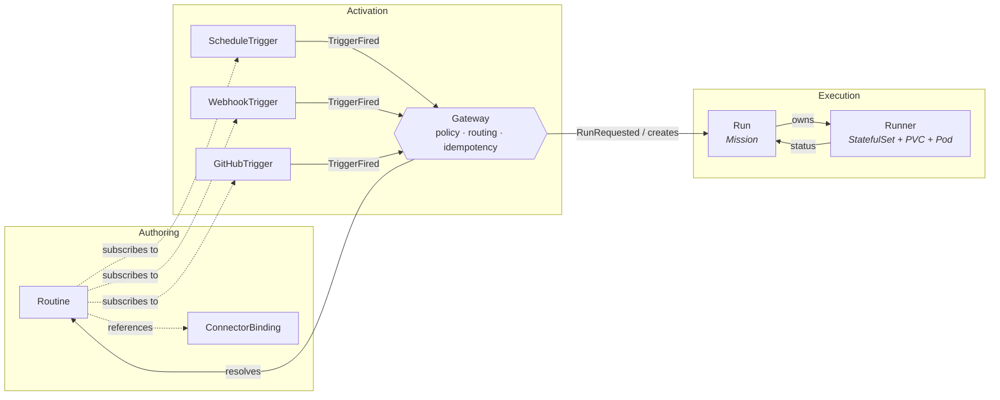

# Routines — Domain Model (v2)

> Status: **draft for review**. This document supersedes the domain framing implicit in
> `_bmad-output/architecture.md` (v1). The architecture doc will be reworked to conform to
> this model once aligned.
>
> Author: CEO · Review: LF (@imneov) · Linked issue: AD-38

## Why this document exists

LF's feedback on the v1 architecture (AD-38 comment, 2026-04-16):

1. Core domain entities are not well-defined; the flow is tech-stacking, not architecture.
2. `trigger / cron / webhook` are **triggers**; `Run` is a **task definition** (Mission). Their relationship must be clearly separated — currently `Trigger` directly creates `Runner`, which muddles the roles.
3. There is no **Gateway** role in the current design.

This doc fixes those three issues by pinning down the **four-role domain** (Trigger → Gateway → Run → Runner), the bounded contexts they live in, and the events that cross those boundaries.

---

## 1. Ubiquitous Language

A single shared vocabulary, used everywhere from code to Helm values to commit messages.

| Term         | Definition                                                                                                                                                                                                           | What it is **not**                                                                                                                           |
| ------------ | -------------------------------------------------------------------------------------------------------------------------------------------------------------------------------------------------------------------- | -------------------------------------------------------------------------------------------------------------------------------------------- |
| **Routine**  | A long-lived, reusable **template** authored by a user. Declares prompt, repo, connectors, safety envelope, and a list of trigger subscriptions. Analogue: `Deployment` or `CronJob` template.                      | Not a running thing. Has no PVC, no Pod, no `phase`.                                                                                         |
| **Trigger**  | A **signal source**. Three kinds: `ScheduleTrigger`, `WebhookTrigger`, `GitHubTrigger`. Its only job is to verify authenticity of an external event and emit a `TriggerFired` domain event.                          | Not a Run creator. Does not know which Routines react. Does not enforce rate limits or CEL filters against the business contract.            |
| **Gateway**  | The **routing + policy boundary** between Triggers and Runs. Consumes `TriggerFired`, resolves which Routines subscribe, applies auth/filter/idempotency/concurrency/suspend policy, and — only then — creates a Run. | Not a Trigger. Not a Runner. Not a user-authored CR in MVP (it's a named in-process component with its own state and audit log).             |
| **Run**      | The **Mission**: an immutable, concrete task definition = `Routine + resolved inputs + trigger provenance + policy decision`. Created exactly once by the Gateway. The *authoritative answer to "what should happen next."* | Not an execution. Not where we store sandbox state. Not mutable on continue — continue appends to `status.history` and cycles `phase`.       |
| **Runner**   | The **execution process** that carries out one Run. Today: a 1-replica `StatefulSet` + `PVC` + sandbox `Pod` running Claude Code. Lifecycle-owned by the Run CR via ownerReferences.                                 | Not a CRD. Not a long-lived worker pool. Ephemeral except for the PVC retained under FR13a.                                                  |

**Key rule (architectural invariant):** The **only** path from Trigger to Runner is `Trigger → Gateway → Run → Runner`. No shortcuts.

---

## 2. Bounded Contexts

Three contexts, each with its own aggregates, invariants, and vocabulary:

| Context          | Owns aggregates                                          | Talks to other contexts via                                        |
| ---------------- | -------------------------------------------------------- | ------------------------------------------------------------------ |
| **Authoring**    | `Routine`, `ConnectorBinding`                            | Pure K8s API reads from other contexts. No event emission.         |
| **Activation**   | `ScheduleTrigger`, `WebhookTrigger`, `GitHubTrigger`, `Gateway` | Emits `TriggerFired`; emits `RunRequested`; reads `Routine` spec.  |
| **Execution**    | `Run` (`RoutineRun` CR), `Runner` (StatefulSet/PVC/Pod)  | Consumes `RunRequested`; emits `RunStarted`, `RunCompleted`, `RunCancelled`. |

This split enforces three properties:

1. **Authoring changes cannot directly cause Runs.** Editing a Routine updates a template; Runs only appear when the Activation context decides so.
2. **Trigger changes cannot bypass policy.** A verified `TriggerFired` is still subject to Gateway admission.
3. **Execution changes cannot fabricate history.** A Runner cannot retroactively create or modify a Run's `spec` — the Run is the mission, the Runner is the executor.

---

## 3. Aggregates & Invariants

### 3.1 Routine — the Template (Authoring)

**Purpose.** Declarative description of *what* an automation should do when fired. Reusable across multiple triggers.

**Key fields** (unchanged from v1 architecture; pasted here for completeness):

- `spec.prompt` — prompt source (inline / ConfigMap / OCI)
- `spec.repositoryRef` — a `ConnectorBinding` naming the target repo
- `spec.connectorBindingRefs` — the **total** allow-list of external credentials
- `spec.triggers` — list of `{scheduleTriggerRef | webhookTriggerRef | githubTriggerRef}` (subscription, not ownership)
- `spec.maxDurationSeconds`, `spec.concurrencyPolicy`, `spec.runRetention`, `spec.suspend`

**Invariants** (enforced by admission):

- Cannot reference a Binding from a different namespace.
- `suspend = true` ⇒ Routine is invisible to Gateway (no Runs created, regardless of Trigger signals).
- `connectorBindingRefs` is closed-set: Runner mounts nothing outside this list.

**Relationships.**

- 1 Routine → N trigger subscriptions (trigger CRs can be shared across Routines).
- 1 Routine → 0..N Runs over its lifetime.
- A Routine **does not own** Runs. Runs are owned via `ownerReferences` for GC, but the *authorization* to fire is Gateway's call, not Routine's.

### 3.2 Trigger — the Signal Source (Activation)

**Purpose.** Detect external events and certify them as genuine, then emit a `TriggerFired` event. **Nothing else.**

**Three kinds, one role:**

| Kind              | Signal origin                         | Authenticity check                            |
| ----------------- | ------------------------------------- | --------------------------------------------- |
| `ScheduleTrigger` | In-cluster cron tick                  | n/a (time is self-authenticating)             |
| `WebhookTrigger`  | Inbound HTTP POST                     | HMAC / Bearer / GitHub App signature          |
| `GitHubTrigger`   | GitHub App webhook delivery           | GitHub App signature (same as Webhook path)   |

**Invariants:**

- A Trigger MUST NOT create a Run, and MUST NOT resolve which Routines will react. That is Gateway's job.
- A `TriggerFired` event MUST carry `{sourceKind, sourceName, sourceNamespace, deliveryId, firedAt, rawPayload}`.
- `suspend = true` on a Trigger ⇒ no events emitted.
- Authenticity check failures produce **no** event, only a metric + audit record.

**Why this decoupling matters.** It lets the same trigger serve multiple Routines, lets the Gateway change policy without touching Trigger code, and lets us unit-test signal authenticity in isolation from Routine resolution.

### 3.3 Gateway — the Routing + Policy Boundary (Activation)

**Purpose.** The **sole gatekeeper** that turns a `TriggerFired` event into a `Run`. Owns all cross-cutting policy.

**Responsibilities (in order, per incoming event):**

1. **Idempotency** — dedup on `(sourceKind, deliveryId)` against a 24-hour window store (MVP: ConfigMap; Phase 2: CRD-backed `IdempotencyRecord`).
2. **Resolution** — reverse-index lookup: which Routines subscribe to this Trigger? Produces 0..N candidate Routines.
3. **Filter** — per-candidate, evaluate subscription-level filters:
   - `GitHubTrigger.filter` CEL expression against the typed `event` struct
   - `WebhookTrigger.allowedEventTypes` against header/path
4. **Authorization** — check Routine `suspend`, tenant-namespace RBAC, binding availability.
5. **Gating** — `concurrencyPolicy` (`Forbid` / `Replace` / `Allow`), rate limit, quota.
6. **Normalization** — project the raw payload into `inputs.text` + `triggerSource` shape.
7. **Emission** — produce a `RunRequested` event and create the `Run` CR (one per surviving candidate Routine).
8. **Audit** — append to `gateway-audit` log with the decision trace (`deliveredAt`, `matchedRoutines`, `dropReason` if any, `runRefs`).

**Invariants:**

- Gateway is the **only** producer of `Run` CRs. An admission webhook enforces this at the K8s API boundary: a Run without a valid Gateway-issued `PolicyDecisionID` annotation is rejected.
- Idempotency is authoritative here. Trigger controllers MUST NOT dedup on their own; Run controllers MUST NOT dedup on their own.
- Gateway has no knowledge of Runner internals (sandbox, PVC, claude code). It stops at Run creation.

**MVP shape.** A named subsystem of the `manager` binary (`internal/gateway/`). Not a CRD in MVP — global defaults + per-Routine policy carried in `Routine.spec`. Phase 2 optional `RoutineGateway` CRD for per-tenant policy.

**Why not merge Gateway into "Webhook Ingress" or "Trigger Router" (as v1 did)?** Because those names hide the policy surface. "Webhook Ingress" is just HTTP transport; "Trigger Router" is just fan-in. Neither name tells a new engineer *where* rate limiting / authorization / idempotency lives, and neither name survives when we later add a `ManualTrigger` (API/CLI) that has no webhook and no router. The Gateway name captures the *responsibility*.

### 3.4 Run — the Mission (Execution)

**Purpose.** An immutable, concrete task definition: *"Routine `R` should be executed with inputs `I`, because Trigger `T` fired at time `τ`, and Gateway admitted it under policy decision `D`."*

**Key fields (delta from v1):**

- `spec.routineRef` — immutable
- `spec.inputs.text` — normalized payload from Gateway
- `spec.triggerSource` — `{kind, name, namespace, deliveryId, firedAt}` (provenance)
- `spec.policyDecisionId` — **new**: Gateway's decision token; admission-verified
- `spec.maxDurationSeconds` — inherited at creation, immutable
- `status.phase`, `status.conditions`, `status.history`, `status.outputs`, `status.sessionPVC`

**Invariants:**

- `spec` is **immutable after creation**. All runtime change lives in `status`.
- `spec.policyDecisionId` is required. Admission rejects Runs without a Gateway-issued decision.
- `status.phase` progresses monotonically within a given `metadata.generation`. `continue` increments `generation` and appends to `status.history`.
- A Run's `status.outputs` is set exactly once, at the terminal transition.

**Why not merge with Routine?** Because the Mission is *not* the template. Three concrete reasons:

1. A Routine lives forever; a Run is a record of a moment. Lifetime ≠ identity.
2. A Routine has no `inputs.text` (that comes from the Trigger). Conflating them makes "which payload triggered this?" unanswerable.
3. Retention policies differ. Routines stay until the user deletes them; Runs respect `runRetention`.

### 3.5 Runner — the Execution Process (Execution)

**Purpose.** The actual compute that carries out one Run.

**Shape.** 1-replica `StatefulSet` + `PVC` + sandbox `Pod`, owned by the Run via `ownerReferences`. Scale 0↔1 implements `continue`/Resumable (FR13a).

**Invariants:**

- Runner is lifecycle-owned by Run. Deleting the Run garbage-collects the Runner.
- Runner writes exit code + outputs file to the PVC; the Run controller reads them and updates `status`.
- Runner has **no** direct API access to create/modify Runs. Its writes flow through the Run controller.

**Not a CRD.** Making Runner a separate CRD would double the state surface with no user-visible benefit. The StatefulSet is already a K8s-native representation of "one running thing with an identity and a disk."

---

## 4. Domain Events

Events are the contracts that cross bounded-context boundaries. All are JSON-serializable, logged to the audit trail, and (for MVP) passed via in-process channels. Phase 2 can promote any of them to a CRD or a message bus.

| Event           | Producer              | Consumer(s)                                | Carries                                                                                         |
| --------------- | --------------------- | ------------------------------------------ | ----------------------------------------------------------------------------------------------- |
| `TriggerFired`  | Trigger controller    | Gateway                                    | `{sourceKind, sourceName, sourceNamespace, deliveryId, firedAt, rawPayload, authVerdict}`       |
| `RunRequested`  | Gateway               | Run controller (via Run CR creation + admission) | `{runRef, routineRef, inputs, triggerSourceRef, policyDecisionId, admittedAt}`                  |
| `RunStarted`    | Run controller        | Routine controller, observability          | `{runRef, routineRef, startedAt, sandboxImageDigest}`                                           |
| `RunCompleted`  | Run controller        | Routine controller, observability          | `{runRef, phase, exitCode, outputs, completedAt}`                                               |
| `RunCancelled`  | user / Run controller | Routine controller, observability          | `{runRef, cause, cancelledAt}`                                                                  |

Every Run has a 1-to-1 `RunRequested` event; every Run ends with exactly one of `RunCompleted` or `RunCancelled`.

---

## 5. Context Map

**Reading the map:**

- Solid arrows = event flow (causal).
- Dotted arrows = reference lookups (non-causal).
- The one-way arrow from **Authoring → Activation** means "Routines are *read* by the Gateway; Authoring is never coupled to runtime."
- Gateway sits on the only path from Trigger to Run. There is no other arrow into `Run`.

---

## 6. What's fixed vs. v1

| Concern                           | v1 (flawed)                                                            | v2 (this doc)                                                                            |
| --------------------------------- | ---------------------------------------------------------------------- | ---------------------------------------------------------------------------------------- |
| Who creates Runs?                 | "Trigger Router" (unnamed role, buried inside `manager`)               | **Gateway** (explicit aggregate, named role, sole creator)                                |
| Trigger's job                     | "register engines, route events, create Runs"                          | **Only** verify signal authenticity and emit `TriggerFired`                               |
| Idempotency                       | Split between webhook ingress, Trigger Router, and Run controller      | Owned exclusively by Gateway                                                              |
| Policy (rate/filter/concurrency)  | Scattered across Trigger controllers, admission webhook, Run controller| Centralized in Gateway                                                                    |
| Mission vs. Execution             | Both folded into "RoutineRun"                                          | `Run` **is the Mission** (immutable task definition); `Runner` **is the Execution** (workload) |
| Naming clarity                    | "Trigger Router", "Webhook Ingress" (transport words)                  | `Gateway` (responsibility word); `Runner` (role word)                                     |
| Admission enforcement             | Runs can be created from multiple paths                                | Runs require a Gateway-issued `policyDecisionId`; admission rejects otherwise             |

---

## 7. Open questions for LF

1. **Gateway as CRD — now or Phase 2?** This doc assumes Phase 2. A `RoutineGateway` CRD gives declarative per-tenant policy but doubles the CRD count. OK to defer, or should MVP ship it?
2. **Runner as CRD — worth it?** This doc says no (StatefulSet is enough). Revisit if we need to expose per-Runner state to users beyond what `Run.status` carries.
3. **"Run = Mission" wording.** Does this doc's interpretation match your mental model? Specifically: I read your comment as *"Run is an immutable task-definition instance (not a template, not an execution)."* If you meant something else — e.g., Run is the template and there should be a separate Runner CRD — flag it and I'll revise.
4. **Article unavailable.** The WeChat article you linked is gated by a captcha I can't pass (`agent-browser` hit the `环境异常` page). If there is a specific pattern from that article you want reflected (e.g., a Chinese-ecosystem convention for this exact split), please paste the relevant section or summarize and I will align.

---

## 8. Next steps (pending your ack of this doc)

1. Rework `_bmad-output/architecture.md` sections: High-Level Overview · Data Models (Run + new Gateway component) · Components (replace "Trigger Router" with "Gateway" subsystem) · Core Workflows (insert Gateway step in all 5 sequence diagrams) · Admission rules (add `policyDecisionId` check).
2. Update CRD Go types: add `Run.spec.policyDecisionId` (required); strip engine-registration duties from Trigger controllers; introduce `internal/gateway/` package owning resolution + dedup + audit.
3. Re-shard architecture.md into `docs/architecture/` once the rework lands (FR: `*shard-doc`).
4. Kick off Epic-1 scaffolding only *after* this domain model is ack'd — otherwise we pour concrete on the wrong foundations.

---

_End of document._
